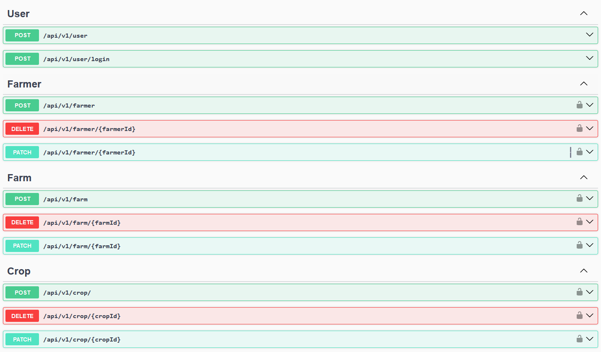

# Agro Brain API
API CRUD com Node.js e Express.js 

## Instalação
`
docker compose up 
`
> Nota: opcionalmente é possivel rodar localmente com as variaveis no arquivo .env. Veja a inicialização em app.js para saber mais.

## Uso 
Acesse a documentação em /api/v1/api-docs para os detalhes sobre os endpoints ou acesse o aquivo src/http/swagger.json para estruturas mockadas.

> Nota: Para os endpoints apontados /farm, /farmer e /crop é necessário enviar um token via headers (X-Acess-Token). O token pode ser requisitado em api/v1/login após o usuario ser cadastrado.  
